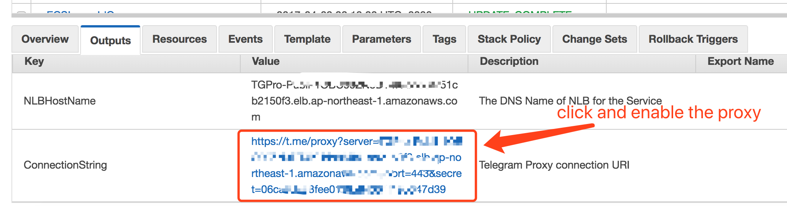

## telegram-proxy-fargate

Create your own Telegram MTProxy with AWS Fargate by launching a cloudformaiton stack

click the button below to launch the stack:

|           Region            |                     Launch Stack in VPC                      |   Runtime   |
| :-------------------------: | :----------------------------------------------------------: | :---------: |
|   **Oregon** (us-west-2)    |  | Fargate+ECS |
| **N. Virginia** (us-east-1) |  | Fargate+ECS |
| **Tokyo** (ap-northeast-1)  |  | Fargate+ECS |

When the cloudformation stack is completed, click the output tab to find the **ConnectionString** and click the link to enable the Telegram **MTProxy.

